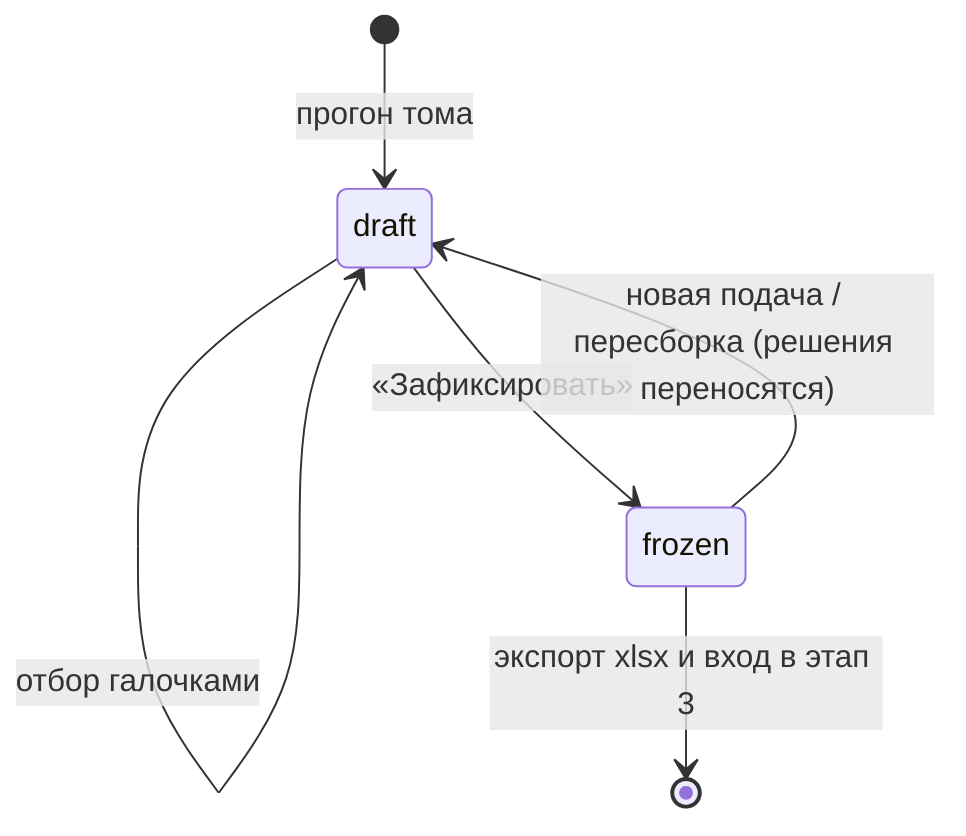

# Этапы 1–2: паспорт тома и план проверки

План на один день. Продолжение `PORTAL_PLAN.md` (портал приёмки) и `AGENT_PLAN.md`
(пайплайн). Правила интеграции те же: портал не знает про pymupdf, `agent/` не знает
про портал, единственная точка стыка — `agent/api.py`, CLI `python -m agent.run`
обязан продолжать работать.

Решения на день 1 приняты явно: **один том** (не комплект), **без LLM**
(только правила), **нормативы — свой мини-реестр**.

**Коротко, если нет времени читать целиком:**

- **Стек не меняется** — FastAPI + Jinja2 + HTMX, Postgres, RQ поверх Redis, pymupdf,
  R2 для файлов, деплой блюпринтом Render. Новых зависимостей две: `PyYAML`
  и `rapidfuzz`. Подробно, с версиями, топологией сервисов и списком того, что сознательно
  не берём, — §13.
- Этап 1 — это не «понять проект», а **сверить заявленное бюро с фактическим PDF**
  по листу «Общие данные» (§4).
- Этап 2 — машина ранжирует спецификацию и объясняет причину, **отбор делает эксперт
  галочками**, решение хранится отдельно от предложения машины (§8).
- Всё детерминированно и воспроизводимо; `checkplan()` пересчитывается за секунды
  без повторного разбора тома (§7).
- День расписан по часам в §11, чего сознательно не делаем — там же.

---

## 1. Что делает эксперт и что из этого забирает машина

| Шаг эксперта | Что забирает машина в день 1 | Что остаётся человеку |
|---|---|---|
| Находит и читает пояснительную записку / общие данные | Разбирает лист «Общие данные»: ведомость чертежей, ведомость основных комплектов раздела, ведомость ссылочных и прилагаемых документов, общие указания, регистрацию изменений | Смысл проектного решения |
| Понимает, по каким документам сделан проект | Извлекает перечень ТНПА (ФЗ / СП / ГОСТ / ПУЭ / постановления), сверяет с реестром: действует / заменён / отменён | Решение, критично ли устаревание |
| Понимает, как читать схему (УГО) | Извлекает таблицу условных обозначений: картинка символа + наименование, как словарь тома | Всё ещё сам смотрит на схему |
| Анализирует спецификацию, выделяет критичные позиции | Ранжирует строки спецификации по сигналам критичности, раскладывает на A/B/C и говорит, **чем** каждую позицию можно проверить | **Отбор галочками: что реально пойдёт в проверку** |

Ключевой смысл этапа 1 для машины: **лист «Общие данные» — это машиночитаемый паспорт
тома**, где бюро само перечислило, что оно сдало. Всё, что там объявлено, можно
немедленно сверить с тем, что реально лежит в PDF. Это первые честные замечания,
которые не требуют ни сверки планов, ни LLM.

Ключевой смысл этапа 2: спецификация на 300–500 строк, а проверять руками можно 30–50.
Машина не решает, что важно — она **сортирует и объясняет причину**. Решает эксперт,
и его решение — не мнение в голове, а состояние в базе, которое переживает повторные
прогоны и уходит на вход этапу 3.

---

## 2. Что уже есть и не переписывается

- `agent/extract.py` — `classify_pages` (тип листа), `parse_spec` (строки спецификации)
- `agent/match.py` — `canon_mark` (канонизация марки), `page_multiplier`
- `agent/cable_journal.py`, `agent/lighting.py`, `agent/measure.py` — источники точности
- `agent/api.py` — фасад: `intake()` → листы, спецификация, `Capabilities`
- `portal/` — модель (Org / Project / Submission / Document / Sheet / SpecItem / Run),
  загрузка через S3-presigned, воркер RQ, прогресс в таблице `run`, вкладки
  «Состав» и «Номенклатура», экспорт xlsx

Новая работа пристраивается сбоку: ни одна существующая функция не меняет сигнатуру.

---

## 3. Структура кода

```
agent/
  general.py      NEW ~220 строк  разбор листа «Общие данные»
  symbols.py      NEW ~120 строк  таблица УГО: наименование + кроп символа
  norms.py        NEW  ~90 строк  распознавание ТНПА + сверка с реестром
  norms_registry.yaml NEW         мини-реестр нормативов (60–80 записей)
  criticality.py  NEW ~180 строк  сигналы критичности, классы A/B/C, ключ позиции
  api.py          +80 строк       passport() и checkplan() за тем же фасадом
  extract.py      без изменений
  match.py        без изменений

portal/
  models.py       +8 таблиц
  migrations/versions/xxxx_passport.py NEW
  tasks.py        +60 строк        сохранение паспорта и черновика плана проверки
  passport.py     NEW ~80 строк    сборка контекста вкладки «Паспорт»
  checkplan.py    NEW ~130 строк   пересборка плана, применение решений, массовые операции
  exporting.py    +60 строк        листы «Паспорт» и «План проверки» в xlsx
  web/app.py      +9 роутов
  web/templates/
    _passport.html       NEW
    _symbols.html        NEW
    _checkplan.html      NEW   таблица отбора
    _checkplan_row.html  NEW   одна строка (её же возвращает HTMX при клике)
    _checkplan_counter.html NEW счётчик отбора (out-of-band swap)
```

Ни одного нового сервиса, ни одной новой внешней зависимости кроме `PyYAML`
и `rapidfuzz` (нечёткое сопоставление формулировок изменений со строками
спецификации; при отсутствии — фолбэк на `difflib`).

---

## 4. Как именно разбирается лист «Общие данные»

Проверено на обоих томах из вложения перед тем, как писать этот план.

`page.find_tables()` из pymupdf 1.28 уверенно берёт разлинованные ведомости, включая
повёрнутые листы (`rotation=90` у СПСиА). На листе «Общие данные» ЭОМ он вернул 23
таблицы, из которых нужные три опознаются **по сигнатуре заголовка**, остальные —
мусор от текстовых блоков и отсеиваются по числу строк и колонок.

```python
SIGNATURES = {
    'sheets':  (('лист', 'наименование', 'примечание'), 3),
    'volumes': (('обозначение', 'наименование', 'примечание'), 3),
    'refs':    (('обозначение', 'наименование', 'примечание'), 3),
    'symbols': (('обозначение', 'наименование'), 2),
}
```

Различение `volumes` / `refs` (сигнатура одинаковая) — по заголовку **над** таблицей
в радиусе 30 pt: «Ведомость основных комплектов…» против «Ведомост(ь|ь) ссылочных
и прилагаемых…» (в СПСиА в заголовке опечатка «Ведомоть» — сопоставление нечёткое,
по вхождению «ссылочн»).

Что достаётся:

1. **Ведомость рабочих чертежей основного комплекта** → `лист №`, `наименование`,
   `изм.` Колонка «Примечание» содержит наложенные слои разных ревизий
   (`Изм.1,2,3,4 Изм. 4 (-)`) — нормализуется регуляркой в множество номеров
   изменений + признак `(Зам.)` / `(Нов.)` / `(-)`.
2. **Ведомость основных комплектов рабочих чертежей раздела** → соседние тома
   (ЭОМ1…ЭОМ4, ЭГ1, ЭГ2, ОЗДС). В день 1 показываем справочно, в неделю 1 сверяем
   с составом подачи.
3. **Ведомость ссылочных и прилагаемых документов** → `.КЖ`, `.СО`, `.АЛ1`, `.РР1`,
   `.ЗД1`, с числом листов («на 45-и листах») и перечнем изменений.
4. **Общие указания** — текстовый блок, не таблица. Забирается по маркеру
   «Общие указания» / «Чертежи разработаны в соответствии» и режется на строки
   по маркеру списка `- `.
5. **Регистрация изменений** (отдельные листы А4 в начале тома) → `№ изм.`,
   `листы`, `содержание изменения`, `основание`, `дата`. Текстовый слой чистый,
   разбор построчный по колонкам таблицы штампа.
6. **Условные обозначения** → строки таблицы, где колонка «Обозначение» пустая
   в текстовом слое: символ там графический. Берём `bbox` ячейки, режем
   `page.get_pixmap(clip=..., dpi=150)`, кладём PNG в то же S3-хранилище, что и тома.
   На повёрнутых листах клип берётся в координатах страницы **до** поворота.

### Немедленные проверки (это и есть первые замечания)

| Проверка | Замечание |
|---|---|
| Заявленные листы против фактических страниц PDF | «В ведомости 60 листов, в файле 59; отсутствует лист 49» |
| Пропуски в нумерации ведомости | «Лист 49 в ведомости отсутствует» (реальный случай в ЭОМ) |
| Наименование листа в ведомости против штампа листа | «Лист 34: в ведомости „1 секция“, в штампе „2 секция“» |
| Заявленные ссылочные документы против файлов подачи | «Объявлен ПР-01/24-1-ЭОМ.КЖ на 45 листах — в подаче нет» |
| Ревизия из имени файла против регистрации изменений | «Файл помечен Изм. 1–4, в томе зарегистрированы 1–3» |
| ТНПА против реестра | «СП 51.13330.2011 заменён на СП 51.13330.2011 с Изм. 1–2 / актуализирован» |
| Символ УГО без единого совпадения в спецификации | «В легенде есть МДУ-1, в спецификации марка не встречается» |

---

## 5. Мини-реестр нормативов

`agent/norms_registry.yaml`, заполняется руками один раз, дополняется по мере встреч:

```yaml
- code: СП 484.1311500.2020
  title: Системы пожарной сигнализации и автоматизация систем противопожарной защиты
  status: active            # active | superseded | cancelled
  since: 2021-03-01
- code: СП 51.13330.2011
  title: Защита от шума
  status: active
  note: действует с Изм. 1–2; ссылаться следует с указанием изменений
- code: СП 5.13130.2009
  status: cancelled
  replaced_by: СП 484.1311500.2020
```

Распознавание в тексте — регуляркой по префиксам `СП | ГОСТ Р | ГОСТ | СНиП | ФЗ |
Федеральный закон | ПУЭ | СанПиН | Постановление`, нормализация номера
(`СП 52.13330-2016` и `СП 52.13330.2016` — одна запись). Неизвестный документ
показывается как «нет в реестре» — не как ошибка. Ноль выдуманных статусов:
чего нет в yaml, про то портал молчит.

---

## 6. Модель критичности позиции (этап 2)

Без LLM. Балл 0–100 складывается из сигналов, у каждого срабатывания в интерфейсе
пишется причина человеческим текстом — эксперт видит, за что позиция попала наверх.

| Сигнал | Балл | Откуда берётся |
|---|---|---|
| Позиция затронута изменениями | +40 | Регистрация изменений: марка/наименование встречается в тексте «Содержание изменения», либо лист `.СО` числится изменённым |
| Единица измерения — метры (кабель, труба, лоток) | +15 | `unit` спецификации; метраж — самая частая ошибка |
| Марка есть в легенде УГО | +20 | `symbols` ↔ `canon_mark`: позиция считается на планах, значит проверяема |
| Топ-10 % по количеству внутри своей единицы | +15 | распределение `qty` по `unit` |
| Головное оборудование (ПКП, ЦПИУ, шкаф, ВРУ, ИБП, УЭРМ) | +10 | словарь ключевых слов; заодно вход в этап 4 |
| Неоднозначность: составная строка, диапазон марок, «по месту», пустая марка | +10 | флаги `composite`, `expanded_range`, `qty is None` |
| Крепёж и расходники (саморез, дюбель, стяжка, хомут, лента, маркер) | −25 | словарь |
| Помечена как непоставляемая / у заказчика | −15 | `excluded` |

Классы: **A** ≥ 55 «проверять обязательно», **B** 25–54 «выборочно», **C** < 25
«не проверять». Пороги вынесены в константы одного модуля и калибруются на прогоне.

Второй столбец, не менее важный, — **чем проверяется**, собирается из `Capabilities`:

- «по планам» — есть УГО и листы планов;
- «по схемам» — марка встречается на структурных схемах;
- «по кабельному журналу» — `has_cable_journal`, точный метраж;
- «по ведомости освещения» — `has_lighting_list`;
- «только глазами» — нечитаемые листы или нет источника.

Класс — это **предложение машины**, а не решение. Решение живёт отдельно (§8).

---

## 7. Поток данных и контракты фасада

```
браузер ──presigned PUT──► S3
        └─POST /api/documents/{id}/ready──► очередь RQ
                                             │
воркер:  intake(pdf)      ─► листы, спецификация, Capabilities
         passport(pdf, …) ─► ведомости, нормативы, УГО, изменения
         checkplan(…)     ─► баллы, классы, причины  (чистая функция, PDF не трогает)
                                             │
                                             ▼
         БД: sheet, spec_item, declared_sheet, doc_ref, norm_ref, symbol,
             revision_entry, check_plan, check_item
                                             │
веб: только читает БД и пишет решения эксперта. Файлы не открывает никогда.
```

Три функции за фасадом, сигнатуры фиксируем сразу:

```python
def intake(pdf, progress=None) -> IntakeResult                  # есть
def passport(pdf, intake=None, progress=None) -> PassportResult # NEW, читает PDF
def checkplan(intake, passport, rules=None) -> list[CheckRow]   # NEW, чистая функция
```

`checkplan()` **не открывает PDF**. Это принципиально: пересчёт плана после правки
порогов или словарей — секунды по данным из БД, а не двадцать минут повторного
разбора тома. Портал вызывает его и при первом прогоне, и при каждом «пересобрать».

Идемпотентность прогона: таблицы паспорта производны от файла и переписываются
целиком; план проверки — нет, он переписывается **с переносом решений эксперта**
(§8.4).

---

## 8. Как эксперт отбирает позиции

Это ядро этапа 2, и в интерфейсе оно должно быть одним действием — галочкой.

### 8.1. Три состояния, а не булев флаг

Хранить «включено / выключено» нельзя: тогда повторный прогон либо затрёт руку
эксперта, либо машина никогда не сможет ничего предложить. Поэтому у позиции два
независимых поля:

| Поле | Кто пишет | Значения |
|---|---|---|
| `cls` | машина | `A` / `B` / `C` — предложение по баллу |
| `decision` | эксперт | `auto` (не трогал) / `take` (беру) / `skip` (снимаю) |

```python
included = {'take': True, 'skip': False}.get(decision, cls == 'A')
```

Интерфейс показывает обе величины: галочка отражает `included`, а рядом — метка
происхождения: «предложено машиной», «взято вручную», «снято экспертом». Отсюда
сразу берётся честная метрика на демо: сколько позиций машина предложила, сколько
эксперт добавил и сколько снял. Второе и третье число — это и есть качество модели.

### 8.2. Что эксперт видит в строке, чтобы решить

Галочка бесполезна, если рядом нет основания. В строке: класс, позиция, наименование
(две строки — различает именно хвост), марка, количество, единица, **причины**
списком и **чем проверяется**. Раскрытие строки даёт доказательство:

- цитату из регистрации изменений — «Изм. 4, лист 26: „Корректировка питания шкафов
  управления вентиляторами дымоудаления — сечений и длин кабелей“»;
- картинку УГО, если марка есть в легенде;
- номер листа спецификации со ссылкой на страницу PDF;
- соседние строки с той же канонической маркой (частый повод снять дубль).

Цитата из изменений — самое сильное основание, поэтому она стоит первой и не
прячется под раскрытие для позиций класса A.

### 8.3. Действия в интерфейсе

| Действие | Как сделано |
|---|---|
| Отметить/снять одну позицию | Чекбокс, `hx-post` на `/api/check-items/{id}/decision`, ответ — перерисованная строка; счётчик обновляется out-of-band |
| Комментарий к позиции | Поле в раскрытой строке: «смотреть только кровлю», уходит в задание этапу 3 и в лист замечаний |
| Массовое действие | Кнопки над таблицей: «взять все A», «взять все изменённые», «снять все C», «применить к отфильтрованному» |
| Фильтры | Только A / только изменённые / только метраж / только непроверяемые машиной / поиск по марке |
| Добавить позицию вручную | Строка, которой нет в спецификации (например, символ из УГО без строки): `source='manual'` |
| Зафиксировать план | Кнопка «Зафиксировать» → версия, статус `frozen`, дальше он только читается |

Правило массовых операций, без которого они опасны: **массовое действие не трогает
строки, где `decision` уже выставлен вручную**, если явно не отмечено «перезаписать».
Иначе один клик «взять все A» стирает полчаса ручной работы. Перед применением
показываем число: «будет изменено 38 позиций, 6 оставлены как есть».

Счётчик наверху постоянно: **«к проверке 47 из 333 — 14 % · 12 добавлено вручную ·
5 снято»**. Это же число уходит в шапку экспорта.

### 8.4. Что происходит при повторном прогоне

Строка спецификации не имеет устойчивого `id` между разборами, поэтому решение
хранится не по `id`, а по **ключу позиции**:

```python
key = sha1(f'{canon_mark}|{norm_name}|{unit}')[:16]
# norm_name: нижний регистр, ё→е, схлопнутые пробелы, без хвостовой пунктуации
# если марки нет — в ключ идут наименование, единица и номер позиции
```

Прогон создаёт **новый черновик плана**, переносит на него решения предыдущего плана
по ключу и показывает разницу: «5 позиций новых, 2 исчезли, 3 изменили количество».
Позиции с изменившимся количеством подсвечиваются — по ним решение перенесено, но
проверять их надо заново. Заморозить план можно только после просмотра разницы.

Решения по ключу дополнительно копятся на уровне проекта (`check_rule`): когда бюро
присылает «Изм. 2», отбор не начинается с нуля — переносится с пометкой «решение из
подачи 1», чтобы эксперт видел, что это наследство, а не предложение машины.

### 8.5. Жизненный цикл плана



Этап 3 (сверка) запускается **только по зафиксированному плану**. Это даёт
воспроизводимость: замечание всегда можно привязать к версии плана, по которому
его нашли.

---

## 9. Модель данных: восемь новых таблиц

Все с `document_id`, без ломки существующих миграций.

```
declared_sheet  page_no, title, revisions[], found (bool), mismatch (str)
doc_ref         kind (attached|referenced|volume), code, title, sheets_note,
                revisions_note, present_in_submission (bool)
norm_ref        code, title_raw, status, replaced_by, known (bool)
symbol          name, code, image_key (S3), page, bbox, matched_marks[]
revision_entry  number, sheets, content, basis, date, doc_code

check_plan      document_id, version, status (draft|frozen), frozen_at, author,
                stats (jsonb: total, proposed, taken, skipped)
check_item      check_plan_id, spec_item_id, key, source (spec|manual),
                score, cls (A|B|C), reasons (jsonb), verifiable_by (jsonb),
                evidence (jsonb: цитата изменения, лист, символ),
                decision (auto|take|skip), decided_at, comment
check_rule      project_id, key, decision, comment, from_submission_id
```

`check_item.decision` и `check_item.comment` — единственные поля во всей новой схеме,
которые пишет человек. Всё остальное производно и может быть пересчитано в любой
момент. Это же граница ответственности: если эксперт спорит с результатом, спор
всегда про `decision`, а не про то, «что там машина сохранила».

---

## 10. Функциональность MVP: два экрана и один файл

**Вкладка «Паспорт тома»** (после «Состав», перед «Номенклатурой»):

1. Шапка: объект, шифр, раздел, стадия, ГИП, число листов, ревизия.
2. «Расхождения» — список немедленных проверок из §4, каждое с номером листа
   и кнопкой «в замечания». Пусто — так и пишем: «расхождений в составе нет».
3. «Состав по ведомости» — таблица заявленных листов с отметкой «есть/нет».
4. «Ссылочные и прилагаемые» — с отметкой присутствия в подаче.
5. «Нормативная база» — перечень ТНПА, цветом: действует / заменён / нет в реестре.
6. «Условные обозначения» — плитка: картинка символа + наименование + сколько раз
   марка встречается в спецификации.
7. «История изменений» — таблица регистрации изменений.

**Вкладка «План проверки»** — таблица отбора из §8: галочка, класс, позиция,
наименование, марка, количество, причины, чем проверяется; фильтры и массовые
действия сверху, там же счётчик и кнопка «Зафиксировать».

**Экспорт**: в существующий xlsx добавляются два листа — «Паспорт» и «План проверки».
Второй печатается в форме задания: только отобранные позиции, с причиной,
комментарием эксперта и колонкой «чем проверяется», плюс шапка с номером и датой
версии плана.

---

## 11. План дня

| Время | Задача | Готовность |
|---|---|---|
| 0:00–1:30 | `agent/general.py`: find_tables + сигнатуры, три ведомости, общие указания, регистрация изменений. Прогон на ЭОМ (153 л.) и СПСиА (22 л.) | JSON паспорта в консоли |
| 1:30–2:15 | `agent/symbols.py`: строки УГО + кроп PNG, включая повёрнутые листы | папка с картинками символов |
| 2:15–3:00 | `agent/norms.py` + реестр на 60–80 записей | перечень со статусами |
| 3:00–4:00 | `agent/criticality.py`: сигналы, веса, классы, ключ позиции, «чем проверяется» | план проверки в консоли |
| 4:00–4:30 | `agent/api.py`: `passport()` и `checkplan()`; отладочный CLI | `python -m agent.api том.pdf` |
| 4:30–5:30 | Портал: миграция, восемь таблиц, сохранение в `tasks.py` | данные в БД после загрузки |
| 5:30–6:30 | Вкладка «Паспорт» | кликабельно |
| 6:30–7:30 | Вкладка «План проверки»: галочки, счётчик, фильтры, массовые действия | отбор работает |
| 7:30–8:00 | Два листа в xlsx | файл выгружается |
| 8:00–9:00 | Прогон на трёх томах, калибровка порогов, коммит и push | демо-репетиция |

Резерв — час: разбор ведомостей на незнакомом томе всегда даёт сюрприз. Если день
окажется короче, первыми режутся нормативы (§5) и история изменений в интерфейсе —
они отделяются без последствий для остального.

### Что сознательно НЕ делаем в день 1

- Не читаем планы и схемы (это этап 3, уже частично есть в `match.py`).
- Не сверяем УГО с тем, что нарисовано на листах, — только легенда как словарь.
- Не считаем достаточность (этап 4).
- Из §8: **схему пишем целиком, а интерфейсом закрываем только отбор**. Версии
  планов, экран разницы между прогонами, перенос решений между подачами
  (`check_rule`) и ручные позиции — поля в базе есть, UI появляется в неделю 1.
  Кнопка «Зафиксировать» в день 1 просто меняет статус.
- Не трогаем вход в портал: он по-прежнему открыт по ссылке (см. `portal_mvp`).
- Не делаем кросс-томных проверок — только то, что заявлено внутри одного тома.

---

## 12. Роадмап

**Неделя 1 — комплект вместо тома и полный цикл отбора.** Ведомость основных
комплектов раздела сверяется с фактическим составом подачи; ссылочные `.СО` и `.КЖ`
разбираются как полноценные документы, а не как отметка «объявлен». Достраивается
интерфейс из §8.4–8.5: экран разницы между прогонами, перенос решений между подачами,
ручные позиции. Расхождения превращаются в черновик листа замечаний с формулировками
по ГОСТ Р 21.101-2020.

**Недели 2–3 — этап 3 в вебе.** `reconcile()` за фасадом: план↔схема, спека↔план,
спека↔схема. Зафиксированный план проверки становится входом: сверяются в первую
очередь отобранные позиции, и каждое замечание ссылается на версию плана.
Замечания по количеству, по метражу (штучному и общему) и по номенклатуре.
Здесь же — первая ревизия («Изм. 2» бюро): что изменилось между подачами и что
из-за этого надо перепроверить.

**Месяц 2 — этап 4, достаточность.** Граф зависимостей: «позиция X требует
позицию Y в количестве f(X)». 20–30 правил на раздел, заданных декларативно
(лифт → тросы, ИБП → аккумуляторы, ПКП → адресные метки и изоляторы, вентилятор →
шкаф управления, клапан → МДУ). Правила пишет эксперт в таблице, не программист
в коде. Отобранные вручную позиции — готовая обучающая выборка: то, что эксперт
раз за разом добавляет руками, и есть кандидат в новое правило критичности.
LLM здесь появляется впервые и по делу: предложить недостающие правила по тексту
общих указаний и алгоритмов, но применять только подтверждённые.

**Дальше** — сравнение подач между собой, накопление словаря марок по объекту,
метрика «сколько замечаний машина нашла раньше эксперта».

---

## 13. Стек

Стек тот же, что у портала приёмки (`PORTAL_PLAN.md`), и это осознанное решение:
этапы 1–2 не приносят ни одной задачи, под которую пришлось бы менять инструмент.
Критерий выбора был и остаётся один — **минимум инфраструктуры, которую придётся
объяснять и чинить**.

| Слой | Выбор | Версия | Почему он и чем платим |
|---|---|---|---|
| Веб | FastAPI + Uvicorn | 0.141.1 / 0.46.0 | Один процесс, никакой асинхронной магии: веб только читает БД и пишет решения эксперта. Платим тем, что админки из коробки нет |
| Шаблоны | Jinja2 | 3.1.6 | Рендер на сервере; строка таблицы отбора и её же HTMX-ответ — один и тот же шаблон |
| Интерактив | HTMX | 1.9.12 (CDN, для закрытого контура кладётся в `/static`) | Отбор из §8 делается за час: чекбокс шлёт `hx-post`, сервер возвращает перерисованную строку и счётчик out-of-band. Ни состояния на клиенте, ни сборки фронтенда, ни рассинхрона между галочкой и базой. Платим тем, что сложный интерактив (drag-n-drop, оффлайн) сюда не приедет |
| БД | Postgres 16 + SQLAlchemy 2 + Alembic | 2.0.52 / 1.19.1 | `jsonb` для причин, доказательств и `verifiable_by` — эти поля меняются каждую неделю, и держать их в колонках дороже, чем в json. Миграции с первого дня |
| Драйвер | psycopg (binary) | 3.3.4 | — |
| Очередь | RQ поверх Redis (Render Key Value) | 2.11.0 / 8.1.0 | Разбор тома — минуты, в вебе ему не место. RQ вместо Celery: одна страница кода вместо конфигурации. В Redis только id задач, прогресс — в таблице `run`, чтобы перезапуск воркера не терял историю |
| Разбор PDF | pymupdf | 1.28.2 | `find_tables()` берёт ведомости (§4), `get_pixmap(clip=)` режет УГО. Альтернатив с таким сочетанием таблиц и растеризации нет |
| Файлы | S3-совместимое (Cloudflare R2), boto3 | 1.43.83 | На Render постоянный диск монтируется только к одному сервису — общего диска у веба и воркера быть не может. Загрузка presigned PUT из браузера мимо веб-процесса |
| Excel | openpyxl | 3.1.5 | Экспорт паспорта и плана проверки |
| **Новое: реестр нормативов** | **PyYAML** | **6.0.x** | Реестр правит эксперт, а не программист. YAML читается глазами и ревьюится в PR |
| **Новое: сопоставление формулировок** | **rapidfuzz** | **3.x** | Связать «Актуализирован метраж кабеля марки КСРЭПнг(А)-FRHF 1x2x1,13» из регистрации изменений со строкой спецификации. Чистые колёса, без компиляции; при отсутствии — фолбэк на `difflib` из стандартной библиотеки |

Python 3.12.7, версии зафиксированы: на них портал прогнан на реальных томах.

### Топология на Render (`render.yaml`, уже написан)

```
svod-web     web       0.5c-512mb   uvicorn, только БД и шаблоны, файлы не открывает
svod-worker  worker    1c-2g        разбор тома: intake → passport → checkplan
svod-db      postgres  basic-256mb  16
svod-kv      keyvalue  free         только очередь задач, ipAllowList пуст
внешнее      R2                     тома и картинки УГО
```

Воркеру нужны 2 ГБ не «на всякий случай»: pymupdf держит страницу А1 и её геометрию
в памяти, и на 150-листовом томе 512 МБ убиваются по OOM молча, без стектрейса.
Этапы 1–2 сюда добавляют только кроп УГО — это десятки маленьких pixmap, память
не двигают.

### Что сознательно не берём

- **Celery, Kafka, воркфлоу-движок** — задача одна и линейная: разобрал том, записал
  результат. RQ покрывает её целиком.
- **React / Vue** — на экране таблица с галочками и фильтрами. Фронтенд-сборка
  добавила бы день работы и постоянную стоимость обслуживания ради нуля новых
  возможностей.
- **OCR (Tesseract и подобное)** — текстовый слой в этих томах чистый, проверено
  на обоих файлах. Нечитаемые листы честно помечаются флагом «смотреть глазами»
  вместо попытки угадать. OCR появится тогда, когда придёт первый скан.
- **Векторная БД и эмбеддинги** — сопоставлений здесь мало и они короткие, `rapidfuzz`
  по канонизированной марке точнее и объяснимее.
- **LLM** — по решению на день 1; и дальше только там, где правило написать нельзя
  (этап 4, §12).
- **Отдельный сервис под этапы 1–2** — новый деплой, новый секрет, новый повод
  рассинхрониться. Это те же две функции за тем же фасадом.

## 14. Дизайн

Промт для Claude Design — `PROMPT_claude_design_passport.md` (продолжение
`PROMPT_claude_design.md` первой версии). Семь артбордов: паспорт тома на двух разных
томах, план проверки, раскрытая строка с доказательством, массовое действие
и зафиксированный план, пустые и сломанные состояния, тёмная тема.

Визуальный язык собран из референсов комбинацией, решения зафиксированы:

- **База — светлый плотный SaaS.** Эксперт живёт в таблице на 300+ строк часами:
  строка, а не карточка; 34 px на строку; моноширинные цифры и марки, потому что
  их сравнивают глазами по колонке.
- **Навигация — дерево объект → подача → тома**, ровно та иерархия, что уже есть
  в модели данных. Плоское меню первой версии её не выражало.
- **Оранжевый акцент означает ровно одно — «затронуто изменением»**, и больше нигде
  не появляется. Светофор готовности (`portal/flags.py`) — отдельная система цветов.
- **Растровая, точечная графика — только там, где она честна:** плитка УГО, где
  символы физически вырезаны кропом со страницы PDF. Точечные цифры в таблицах
  не используются — они нечитаемы в колонках.

Два состояния в прототипе несут смысл модели критичности и должны пережить любую
переделку дизайна: расходник с пометкой «изменено», оставшийся в классе C, —
машина знает про изменение и всё равно не тянет саморез наверх; и массовая позиция
класса B с меткой «взято вручную» — эксперт поправил недооценку. Интерфейс, который
это показывает, объясняет продукт лучше любого описания алгоритма.

## 15. Риски

| Риск | Что делаем |
|---|---|
| На незнакомом томе ведомость свёрстана иначе и `find_tables` её не берёт | Фолбэк на разбор по словам с координатами; если и он молчит — портал честно пишет «ведомость не распознана», а не показывает пустую таблицу |
| Наложенные слои ревизий в колонке «Примечание» | Нормализация в множество номеров изменений; при неоднозначности показываем сырой текст |
| Пороги A/B/C подобраны на двух томах и не обобщатся | Пороги — константы в одном месте, `checkplan()` пересчитывается за секунды без разбора PDF; на демо показываем не только класс, но и причину, а эксперт правит отбор руками |
| Массовое действие затирает ручной отбор | Массовые операции не трогают строки с выставленным `decision`, число затронутых показывается до применения |
| Повторный прогон теряет отбор | Решения хранятся по ключу позиции, а не по `id` строки; перед заморозкой показывается разница между прогонами |
| Кроп УГО на повёрнутом листе даёт пустую картинку | Клип в координатах до поворота; проверяется на СПСиА (`rotation=90`) в первый же час |
